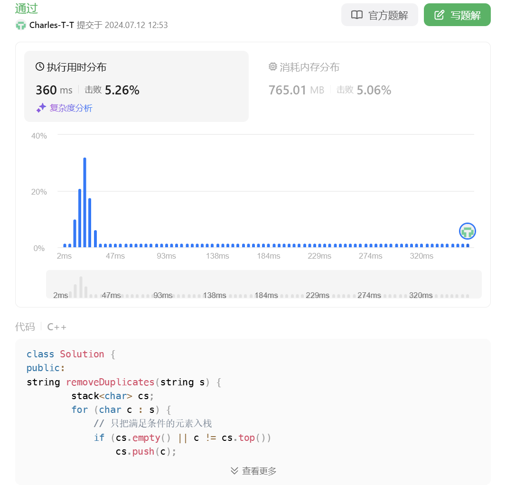
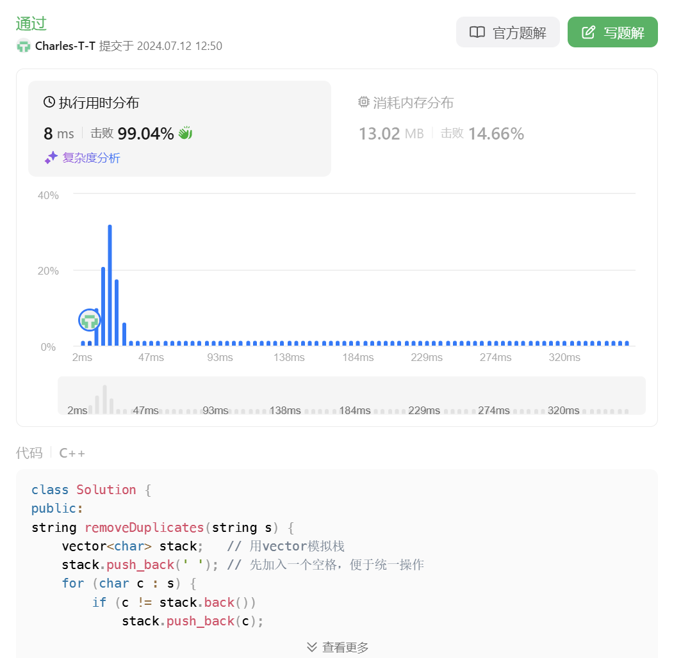

# 1047. 删除字符串中的所有相邻元素

[点此跳转题目链接](https://leetcode.cn/problems/remove-all-adjacent-duplicates-in-string/description/)

## 题目描述

给出由小写字母组成的字符串 `S`，**重复项删除操作**会选择两个相邻且相同的字母，并删除它们。

在 S 上反复执行重复项删除操作，直到无法继续删除。

在完成所有重复项删除操作后返回最终的字符串。答案保证唯一。

 

**示例：**

```
输入："abbaca"
输出："ca"
解释：
例如，在 "abbaca" 中，我们可以删除 "bb" 由于两字母相邻且相同，这是此时唯一可以执行删除操作的重复项。之后我们得到字符串 "aaca"，其中又只有 "aa" 可以执行重复项删除操作，所以最后的字符串为 "ca"。
```

 

**提示：**

1. `1 <= S.length <= 20000`
2. `S` 仅由小写英文字母组成。


## 题解

这题一看就和 [LeetCode 20. 有效的括号](https://github.com/Charles-T-T/Algorithm-Practice/tree/master/2nd-try/20) 很像，可以采用类似的思路，即将字符逐个入栈，期间检查：若当前字符与栈顶字符相同，就将栈顶字符弹出。最后，将栈中字符重新连成字符串即可。

> 好像消消乐 :eyes: 

**代码（C++）**

```cpp
string removeDuplicates(string s)
{
    stack<char> cs;
    for (char c : s) {
        if (!cs.empty()) {
            if (c == cs.top())
                cs.pop();
            else    
                cs.push(c);
        } else 
            cs.push(c);
    }
    string res = "";
    while (!cs.empty()) {
        res = cs.top() + res; // 栈顶元素加入字符串头部
        cs.pop();
    }
    return res;
}
```

但进一步思考可以发现，其实没必要这样“先加入，再检查，不符合条件就出栈”，而可以“先检查，确定能加再加入”：

```cpp
string removeDuplicates(string s) {
    stack<char> cs;
    for (char c : s) {
        // 只把满足条件的元素入栈
        if (cs.empty() || c != cs.top())
            cs.push(c);
        else
            cs.pop();
    }
    string res = "";
    while (!cs.empty())
    {
        res = cs.top() + res; // 栈顶元素加入字符串头部
        cs.pop();
    }
    return res;
}
```

不过这两种方法受栈操作的较低效率限制，速度较慢：



我们可以用 `vector` 模拟栈，进一步优化实际运行速度：

```cpp
string removeDuplicates(string s) {
    vector<char> stack;   // 用vector模拟栈
    stack.push_back(' '); // 先加入一个空格，便于统一操作
    for (char c : s) {
        if (c != stack.back())
            stack.push_back(c);
        else
            stack.pop_back();
    }
    return string(stack.begin() + 1, stack.end());
}
```

这种写法的时空开销都小不少，LeetCode上看到运行速度明显提升：

