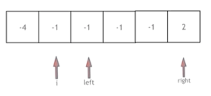

# 15. 三数之和

[点此跳转题目链接](https://leetcode.cn/problems/3sum/description/)

## 题目描述

给你一个整数数组 `nums` ，判断是否存在三元组 `[nums[i], nums[j], nums[k]]` 满足 `i != j`、`i != k` 且 `j != k` ，同时还满足 `nums[i] + nums[j] + nums[k] == 0` 。请

你返回所有和为 `0` 且不重复的三元组。

**注意：** 答案中不可以包含重复的三元组。

 

**示例 1：**

```
输入：nums = [-1,0,1,2,-1,-4]
输出：[[-1,-1,2],[-1,0,1]]
解释：
nums[0] + nums[1] + nums[2] = (-1) + 0 + 1 = 0 。
nums[1] + nums[2] + nums[4] = 0 + 1 + (-1) = 0 。
nums[0] + nums[3] + nums[4] = (-1) + 2 + (-1) = 0 。
不同的三元组是 [-1,0,1] 和 [-1,-1,2] 。
注意，输出的顺序和三元组的顺序并不重要。
```

**示例 2：**

```
输入：nums = [0,1,1]
输出：[]
解释：唯一可能的三元组和不为 0 。
```

**示例 3：**

```
输入：nums = [0,0,0]
输出：[[0,0,0]]
解释：唯一可能的三元组和为 0 。
```

 

**提示：**

- `3 <= nums.length <= 3000`
- `-105 <= nums[i] <= 105`


## 题解

> 今天最恶心的一道题目 :upside_down_face: 
>
> <p align="right">
> ——2024/7/10
> </p>

首先好好读题，可以发现要找的三元组涉及两个 **“去重”** 问题：

- 三元组内各元素在原数组中的下标不能重复（也就是说，原数组每个位置的元素只能用一次）

  > 这里指的是元素本身，而不是其数字值。比如数组中本来就有两个1，那么三元组中可以用两个1。

- 三元组之间不能重复（也就是不能同时返回 `(1, 2, 1)` 和 `(1, 1, 2)` 这样数字相同的三元组）

受到之前做过的 [四数相加 II](https://github.com/Charles-T-T/Algorithm-Practice/tree/master/Hash/454-fourSumCount) 这题影响，一开始想用类似的“哈希表+分治”思路解决，写出如下代码（c++）：

```cpp
vector<vector<int>> threeSum_Fail(vector<int> &nums)
{
    // 哈希表 + 分治
    vector<vector<int>> res;
    unordered_map<int, vector<pair<int, int>>> sumMap; // 前两个数 a, b 之和及其下标
    for (int i = 0; i < nums.size() - 1; i++)
    {
        for (int j = i + 1; j < nums.size(); j++)
            sumMap[nums[i] + nums[j]].emplace_back(i, j);
    }

    // 用一个哈希集合存已得到结果（三元组转为字符串），便于去重
    unordered_set<string> strSet;

    // 查找第三个数 c 凑成 0 所需的前两数之和，即 -c
    for (int i = 0; i < nums.size(); i++)
    {
        if (sumMap.find(-nums[i]) != sumMap.end())
        {
            for (pair p : sumMap[-nums[i]])
            {
                if (i == p.first || i == p.second)
                    continue; // 三元组中不能有同一下标的数字
                vector<int> vec = {nums[i], nums[p.first], nums[p.second]};
                sort(vec.begin(), vec.end());
                string str = to_string(vec[0]) + "_" + to_string(vec[1]) + "_" + to_string(vec[2]);
                if (strSet.find(str) == strSet.end())
                {
                    res.push_back(vec);
                    strSet.insert(str);
                }
            }
        }
    }
    return res;
}
```

这么写，首先通过 `i` , `j` 不重复的二重循环获得前两个数字之和及其下标，再从中找第三个数字凑成0需要的”另一半“。同时，将每次得到的三元组排序后转换成字符串，加入一个哈希集合，达到去重的目标。该算法通过了LeetCode中90%以上的测试样例，但在一个特殊样例上超时：几千个0组成的数组 :clown_face: 

超时原因不言而喻：没有全面而有效的**剪枝**策略。如果还是用哈希表解决，可以参考卡哥代码随想录的去重、剪枝思路，代码如下（c++）：

```cpp
vector<vector<int>> threeSum(vector<int>& nums) {
    vector<vector<int>> result;
    sort(nums.begin(), nums.end());
    // 找出a + b + c = 0
    // a = nums[i], b = nums[j], c = -(a + b)
    for (int i = 0; i < nums.size(); i++) {
        // 排序之后如果第一个元素已经大于零，那么不可能凑成三元组
        if (nums[i] > 0) {
            break;
        }
        if (i > 0 && nums[i] == nums[i - 1]) { //三元组元素a去重
            continue;
        }
        unordered_set<int> set;
        for (int j = i + 1; j < nums.size(); j++) {
            if (j > i + 2
                    && nums[j] == nums[j-1]
                    && nums[j-1] == nums[j-2]) { // 三元组元素b去重
                continue;
            }
            int c = 0 - (nums[i] + nums[j]);
            if (set.find(c) != set.end()) {
                result.push_back({nums[i], nums[j], c});
                set.erase(c);// 三元组元素c去重
            } else {
                set.insert(nums[j]);
            }
        }
    }
    return result;
}
```

下面采用更适合这题的**双指针**解法。

> 所谓”适合“是指去重方法和整体思路更直观



如图所示（图源：[代码随想录](https://programmercarl.com/0015.三数之和.html#思路) ），首先将数组升序排列，然后定义3个**有序**的指针 `i` , `left` , `right` ，其中

-  `i` 是最外层循环指针，逐个遍历数组中的元素
-  `left` 每次初始化为 `i` 的下一个位置，然后可向右移动
-  `right` 每次初始化为数组的最后一个位置，然后可向左移动

可以看出，虽然用了三指针，核心还是后面的两个经典的**左右双指针**。由于限定这些指针不相遇，所以自然解决了下标去重的问题。然后还需要考虑三元组 `a, b, c` 之间去重的问题，这可以通过灵活移动指针解决：由于三个指针总是有序的，所以每个指针都不应该“连续指向相同的数”。其他细节去重方法见代码注释。

> 比如， `i` 这次指向了-1，若下次又指向-1，相当于**考虑了两次 `a = -1` 的三元组**，显然没必要。

**代码（C++）**

```cpp
vector<vector<int>> threeSum(vector<int> &nums)
{
    vector<vector<int>> res;
    sort(nums.begin(), nums.end());

    // 目标三元组为 (a, b, c)
    for (int i = 0; i < nums.size(); i++)
    {
        if (nums[i] > 0) break; // 升序排列后，第一个数a仍大于0，则三元组之和必大于0了
        if (i > 0 && nums[i] == nums[i - 1]) continue; // 对a去重

        int left = i + 1, right = nums.size() - 1;
        while (left < right)
        {
            int curSum = nums[i] + nums[left] + nums[right];
            if (curSum == 0)
            {
                res.emplace_back(vector<int>{nums[i], nums[left], nums[right]});

                // 对left和right去重
                while (left < right && nums[left] == nums[left + 1]) left++;
                while (left < right && nums[right] == nums[right - 1]) right--;

                // 双指针向中间移动，进行下一轮
                left++, right--;
            }
            // 没找到则根据情况移动左右指针
            else if (curSum < 0) left++;
            else right--;
        }
    }
    return res;
}
```

细节深入可参见[代码随想录 (programmercarl.com)](https://programmercarl.com/0015.三数之和.html#思路)。