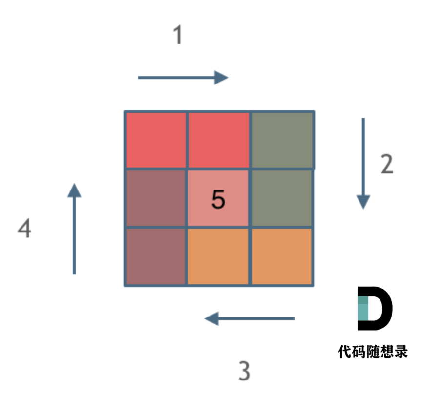

# 59. 螺旋矩阵 II

[点此跳转题目链接](https://leetcode.cn/problems/spiral-matrix-ii/description/)

## 题目描述

给你一个正整数 `n` ，生成一个包含 `1` 到 `n2` 所有元素，且元素按顺时针顺序螺旋排列的 `n x n` 正方形矩阵 `matrix` 。

 

**示例 1：**


```
输入：n = 3
输出：[[1,2,3],[8,9,4],[7,6,5]]
```

**示例 2：**

```
输入：n = 1
输出：[[1]]
```

 

**提示：**

- `1 <= n <= 20`


## 题解

这题其实算法上没啥难度，主要要求对数组有清晰的控制。印象深刻的是第一次做这道题的时候debug疯了，究其原因是没有个统一、清晰的处理思路，导致最后总有个别地方数字错误，难以完全通过。

这次是二刷还是三刷了，终于一次性搞定，思路也比较清晰，核心就是：

- 从外向内**逐层**处理
- 每一层中，按上-右-下-左的顺序（顺时针）处理每条边，且每条边按照 **“前闭后开”** 的原则处理：



如上图所示，同种颜色代表处理这条边的时候需要填数的位置。这样，边长为n的正方形层里，每条边都统一地处理自己的n-1个单位即可。

> 图片来源：[卡哥解析文章](https://programmercarl.com/0059.螺旋矩阵II.html#思路)

### 代码

各变量都有注释说明，建议拿3x3和4x4的矩阵对照着过一遍，应该就能get到了。

```cpp
vector<vector<int>> generateMatrix_II(int n)
{
    vector<vector<int>> res(n, vector<int>(n));
    int curLayer = 0;   // 当前正在处理的层号，从外到内计数
    int curSideLen = n; // 当前在处理的这层正方形的边长
    int curNum = 1;     // 当前要填入矩阵的数字

    // 一层层处理，每层的各条边采用“前闭后开”的原则
    while (curSideLen > 0)
    {
        // 处理上边
        for (int j = curLayer; j < curLayer + curSideLen - 1; j++)
            res[curLayer][j] = curNum++;
        // 处理右边
        for (int i = curLayer; i < curLayer + curSideLen - 1; i++)
            res[i][curLayer + curSideLen - 1] = curNum++;
        // 处理下边
        for (int j = curLayer + curSideLen - 1; j > curLayer; j--)
            res[curLayer + curSideLen - 1][j] = curNum++;
        // 处理左边
        for (int i = curLayer + curSideLen - 1; i > curLayer; i--)
            res[i][curLayer] = curNum++;

        curLayer++;      // 往内处理下一层
        curSideLen -= 2; // 下一层边长减2
    }

    // 如果是奇数阶矩阵，还要填中心元素
    if (n % 2 == 1)
        res[n / 2][n / 2] = n * n;

    return res;
}
```

