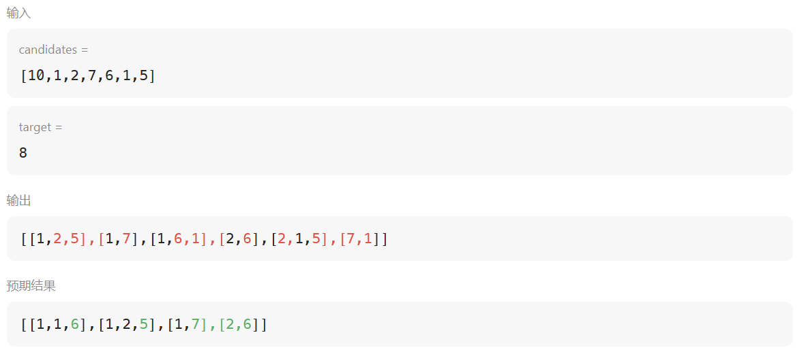
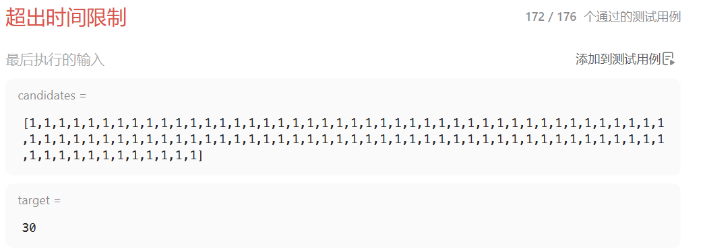

# 40. 组合总和 II

[点此跳转题目链接](https://leetcode.cn/problems/combination-sum-ii/description/)

## 题目描述

给定一个候选人编号的集合 `candidates` 和一个目标数 `target` ，找出 `candidates` 中所有可以使数字和为 `target` 的组合。

`candidates` 中的每个数字在每个组合中只能使用 **一次** 。

**注意：** 解集不能包含重复的组合。 

 <br>

**示例 1:**

```
输入: candidates = [10,1,2,7,6,1,5], target = 8,
输出:
[
[1,1,6],
[1,2,5],
[1,7],
[2,6]
]
```

**示例 2:**

```
输入: candidates = [2,5,2,1,2], target = 5,
输出:
[
[1,2,2],
[5]
]
```

 <br>

**提示:**

- `1 <= candidates.length <= 100`
- `1 <= candidates[i] <= 50`
- `1 <= target <= 30`

<br>

## 题解

这题的基本框架还是很经典的回溯算法，和 [打卡-回溯算法 I]([24暑假算法刷题 | Day22 | LeetCode 77. 组合，216. 组合总和 III，17. 电话号码的字母组合-CSDN博客](https://blog.csdn.net/weixin_54468359/article/details/140668113?spm=1001.2014.3001.5501)) 中的几道题差不多，按部就班地写出 **回溯三部曲** 

- 处理
- 递归
- 回溯

就能得到底层代码：

```cpp
class Solution
{
private:
    vector<int> path;
    vector<vector<int>> res;

public:
    void backTracking(const vector<int> &candidates, int target, int curSum, int start)
    {
        // 递归出口（纵向遍历）
        if (curSum == target)
        {
            res.push_back(path);
            return;
        }

        // 剪枝
        if (curSum > target)
            return;

        // 横向遍历
        for (int i = start; i < candidates.size(); ++i)
        {
            path.push_back(candidates[i]);
            curSum += candidates[i];                         // 处理
            backTracking(candidates, target, curSum, i + 1); // 递归
            path.pop_back();                                 // 回溯
            curSum -= candidates[i];
        }
    }

    vector<vector<int>> combinationSum2(vector<int> &candidates, int target)
    {
        backTracking(candidates, target, 0, 0);
        return res;
    }
};
```

但是这样会出现 **重复** 的问题，例如：



于是下一个难点就是 **去重** 了。首先尝试了简单地用 `set` / `map` 之类的全局记录去重，但是这样容易在一些阴间测试用例下超时：



也就是说，我们还是需要在 **搜索过程中** 就完成去重。

引入一个用于去重的数组 `used` ，大小和 `candidates` 相同，表示 `candidates` 中对应位置的数是否在当前的组合中已经使用过。根据题目描述， `candidates` 中的每个数字在每个组合中只能使用一次，且解集中不能包含重复的组合，也就是说，在 **回溯的树形结构图** 中， **同一个树枝上** 可以有重复，但是某节点下的 **同一层** 不能有重复：

> :warning: 这种算法需要先将 `candidates` **排序** ，目的是将重复的数字放在一起，便于去重


> 图片来源：[代码随想录-40](https://programmercarl.com/0040.组合总和II.html#思路)

这里判断重复的方法是：

如果 `candidates[i] == candidates[i - 1]` **且** `used[i- 1] == 0` ，则说明 **同一层的前一个节点已使用过 `candidates[i - 1]` 这个与当前数字重复的值** ，需要去重（即跳过当前的  `candidates[i]` ）。

上面的两个条件中，前者好理解（就是遇到重复数字），后者的原因在于：

- 如果 `used[i - 1] == 1` ，说明 `candidates[i - 1]` 之前加到了当前组合中，也就是这是 **同一个树枝** 上的操作，即通过 **递归纵向遍历** 得到的

- 如果 `used[i - 1] == 0` ，说明 `candidates[i - 1]` 不在当前组合中，那么它应该是在 **树中同一层的前一个节点** 使用过了，即通过 **回溯横向遍历** 得到的

下面搬运Carl的两张图便于进一步理解：


**代码（C++）**

```cpp
class Solution
{
private:
    vector<int> path;
    vector<vector<int>> res;
    vector<int> used;

public:
    void backTracking(const vector<int> &candidates, int target, int curSum, int start)
    {
        // 递归出口（纵向遍历）
        if (curSum == target)
        {
            res.push_back(path);
            return;
        }

        // 剪枝
        if (curSum > target)
            return;

        // 横向遍历
        for (int i = start; i < candidates.size(); ++i)
        {
            // 去重
            if (i > start && candidates[i] == candidates[i - 1] && !used[i - 1])
                continue;
            // 处理
            path.push_back(candidates[i]);
            curSum += candidates[i];       
            used[i] = 1;
            // 递归
            backTracking(candidates, target, curSum, i + 1); 
            // 回溯
            path.pop_back();                                 
            curSum -= candidates[i];
            used[i] = 0;
        }
    }

    vector<vector<int>> combinationSum2(vector<int> &candidates, int target)
    {
        used.resize(candidates.size());
        sort(candidates.begin(), candidates.end()); // 先排序，便于搜索过程中去重
        backTracking(candidates, target, 0, 0);
        return res;
    }
};
```

