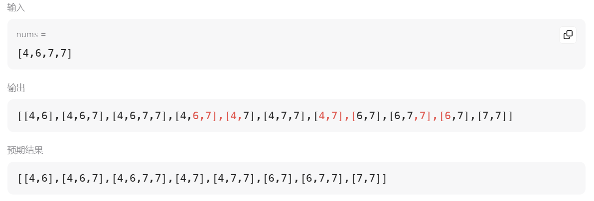

# 491. 非递减子序列

[点此跳转题目链接](https://leetcode.cn/problems/non-decreasing-subsequences/description/)

## 题目描述

给你一个整数数组 `nums` ，找出并返回所有该数组中不同的递增子序列，递增子序列中 **至少有两个元素** 。你可以按 **任意顺序** 返回答案。

数组中可能含有重复元素，如出现两个整数相等，也可以视作递增序列的一种特殊情况。

 

**示例 1：**

```
输入：nums = [4,6,7,7]
输出：[[4,6],[4,6,7],[4,6,7,7],[4,7],[4,7,7],[6,7],[6,7,7],[7,7]]
```

**示例 2：**

```
输入：nums = [4,4,3,2,1]
输出：[[4,4]]
```

 

**提示：**

- `1 <= nums.length <= 15`
- `-100 <= nums[i] <= 100`


## 题解

回溯算法解决。首先搭建基本框架：

```cpp
class Solution
{
private:
    vector<int> path;
    vector<vector<int>> res;

public:
    void backTracking(const vector<int> &nums, int start) {
        // 每次将当前非递减子序列加入结果集
        if (path.size() > 1)
            res.push_back(path); 
        // 递归出口（纵向遍历）
        if (start >= nums.size())
            return;
        // 横向遍历
        for (int i = start; i < nums.size(); ++i) {
            // 处理
            if (path.empty() || nums[i] >= path.back())
                path.push_back(nums[i]);
            else
                continue;
            backTracking(nums, i + 1); // 递归
            path.pop_back();           // 回溯
        }
    }

    vector<vector<int>> findSubsequences(vector<int> &nums)
    {
        backTracking(nums, 0);
        return res;
    }
};
```

但是这样会导致重复子序列的问题，例如：



于是思考去重方案。本题和 [40. 组合总和 II](https://leetcode.cn/problems/combination-sum-ii/description/) 一样，都需要对回溯树型结构中 **“同一父节点下的同一层”** （下面简称 **“同一层”** ）节点值进行去重。那道题使用了 `used` 数组（详解参见 [笔记-40(github)](https://github.com/Charles-T-T/Algorithm-Practice/tree/master/Back-tracking/40-combinationSum2) / [笔记-40(csdn)](https://blog.csdn.net/weixin_54468359/article/details/140798384?spm=1001.2014.3001.5502) ），但本题不能直接用那个套路，因为那种算法需要先将原数组 **排序** 从而将重复值放在一起，而本题就是要求原数组中的有序列，自然不能先排序。

考虑用一个 **集合** 存储当前同一层使用过的节点值，从而避免同一层的节点值重复。由于同一层的节点选取是横向遍历的过程，即某次回溯函数中的 `for` 循环部分，故可以在此之前新建一个局部的 `unordered_set` ，就可以方便的记录当前这层用过的节点值了。

扒一张 [代码随想录](https://programmercarl.com/0491.递增子序列.html#思路) 上的树形图，便于进一步理解：


> :warning: 如果放在回溯函数外，该集合成为全局变量，处理起来会不方便

**代码（C++）** 

```cpp
class Solution
{
private:
    vector<int> path;
    vector<vector<int>> res;

public:
    void backTracking(const vector<int> &nums, int start)
    {
        // 每次将当前非递减子序列加入结果集
        if (path.size() > 1)
            res.push_back(path);
        // 递归出口（纵向遍历）
        if (start >= nums.size())
            return;
        // 横向遍历
        unordered_set<int> used; // 记录本层节点用过的值
        for (int i = start; i < nums.size(); ++i)
        {
            // 去重
            if (used.find(nums[i]) != used.end())
                continue;
            used.insert(nums[i]);
            // 处理
            if (path.empty() || nums[i] >= path.back())
                path.push_back(nums[i]);
            else
                continue;
            backTracking(nums, i + 1); // 递归
            path.pop_back();           // 回溯
        }
    }

    vector<vector<int>> findSubsequences(vector<int> &nums)
    {
        backTracking(nums, 0);
        return res;
    }
};
```

