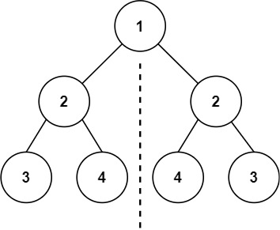

# 101. 对称二叉树

[点此跳转题目链接](https://leetcode.cn/problems/symmetric-tree/description/)

## 题目描述

给你一个二叉树的根节点 `root` ， 检查它是否轴对称。

 

**示例 1：**



```
输入：root = [1,2,2,3,4,4,3]
输出：true
```

**示例 2：**


```
输入：root = [1,2,2,null,3,null,3]
输出：false
```

 

**提示：**

- 树中节点数目在范围 `[1, 1000]` 内
- `-100 <= Node.val <= 100`

 

**进阶：** 你可以运用递归和迭代两种方法解决这个问题吗？


## 题解

核心是检查“对称”的逻辑：

- 当前节点的左右孩子节点值是否相同
- 当前节点的**外层**孙子节点值是否相同（左孩子的左孩子 & 右孩子的右孩子）
- 当前节点的**内层**孙子节点值是否相同（左孩子的右孩子 & 右孩子的左孩子）
- 从根节点向下依此类推

因此容易想到用递归解决，注意左右孩子节点是否为空的分类讨论：
```cpp
bool compare(TreeNode *left, TreeNode *right)
{
    // 首先排除左右有空节点的情况
    if (!left ^ !right)
        return false; // 一个为空、一个不为空，肯定不对称
    else if (!left && !right)
        return true; // 皆为空，对称
    // 然后处理左右都不为空的情况
    if (left->val != right->val)
        return false;
    bool outCmp = compare(left->left, right->right); // 比较外层情况
    bool inCmp = compare(left->right, right->left);  // 比较内层情况
    return outCmp && inCmp;
}

bool isSymmetric(TreeNode *root)
{
    if (!root)
        return false;
    return compare(root->left, root->right);
}
```

接下来尝试迭代法解决。判断逻辑和上面相同，由于需要逐层判断，联想到基于层序遍历的框架，利用队列实现：
```cpp
bool isSymmetric_II(TreeNode *root)
{
    if (!root)
        return root;
    queue<TreeNode *> q;
    q.push(root->left);
    q.push(root->right);
    while (!q.empty())
    {
        TreeNode *left = q.front();
        q.pop();
        TreeNode *right = q.front();
        q.pop();
        // 左右都为空：对称
        if (!left && !right)
            continue;
        // 左右之一为空，或左右不为空但值不相等：不对称
        if (!left ^ !right || left->val != right->val)
            return false;
        // 处理孩子节点
        q.push(left->left);
        q.push(right->right);
        q.push(left->right);
        q.push(right->left);
    }
    return true;
}
```

注意一下最后孩子节点的入队列顺序，依然是“外层”和“内层”成对入队列的。