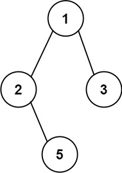

# 257. 二叉树的所有路径

[点此跳转题目链接](https://leetcode.cn/problems/binary-tree-paths/description/)

## 题目描述

给你一个二叉树的根节点 `root` ，按 **任意顺序** ，返回所有从根节点到叶子节点的路径。

**叶子节点** 是指没有子节点的节点。

 

**示例 1：**



```
输入：root = [1,2,3,null,5]
输出：["1->2->5","1->3"]
```

**示例 2：**

```
输入：root = [1]
输出：["1"]
```

 

**提示：**

- 树中节点的数目在范围 `[1, 100]` 内
- `-100 <= Node.val <= 100`


## 题解

首先考虑递归解法，有两种，一是传统的DFS（深度优先搜索）：

```cpp
void getPathDFS(TreeNode *root, string path, vector<string> &res)
{
    if (root)
    {
        path += to_string(root->val);
        // 递归出口：遍历到叶子节点
        if (!root->left && !root->right)
            res.push_back(path);
        else
        {
            path += "->";
            getPathDFS(root->left, path, res);
            getPathDFS(root->right, path, res);
        }
    }
}

vector<string> binaryTreePaths(TreeNode *root)
{
    vector<string> res;
    getPathDFS(root, "", res);
    return res;
}
```

二是结合**回溯**法，在基于递归的**前序遍历**框架下实现：

```cpp
void traversal(TreeNode *root, vector<int> &paths, vector<string> &res)
{
    // 由于需要找到所有路径，采用前序遍历实现
    paths.push_back(root->val); // 中
    // 递归出口：遍历到叶子节点
    if (!root->left && !root->right)
    {
        string path = to_string(paths[0]);
        for (int i = 1; i < paths.size(); ++i)
            path += "->" + to_string(paths[i]);
        res.push_back(path);
        return;
    }
    if (root->left)
    {
        traversal(root->left, paths, res); // 左
        paths.pop_back();                  // 回溯
    }
    if (root->right)
    {
        traversal(root->right, paths, res); // 右
        paths.pop_back();                   // 回溯
    }
}

vector<string> binaryTreePaths(TreeNode *root)
{
    vector<string> res; // 最终的结果集
    vector<int> paths;  // 存储每条路径的数组（按照路径上节点的值）
    if (!root)
        return res;
    traversal(root, paths, res);
    return res;
}
```

其中每次**回溯**的作用相当于回退到上一个“分支点”，再选择一条与之前不同的分支进行操作，原理可以参考 [代码随想录本题讲解](https://programmercarl.com/0257.二叉树的所有路径.html#思路) 中的这张图，从始至终走一遍应该就能领会了：


最后还是考虑一下迭代法，同上面一样，要基于前序遍历的框架实现，具体来说就是在 [统一迭代法](https://programmercarl.com/二叉树的统一迭代法.html#思路) 的基础上，新建一个存储当前路径的栈，随着“右左中”节点的入栈，相应的路径也要更新、入栈：

```cpp
vector<string> binaryTreePaths(TreeNode *root)
{
    // 基于前序遍历的统一迭代法实现
    vector<string> res;
    stack<string> pathSt;
    stack<TreeNode *> nodeSt;
    if (!root)
        return res;
    nodeSt.push(root);
    pathSt.push(to_string(root->val));
    while (!nodeSt.empty())
    {
        TreeNode *node = nodeSt.top();
        nodeSt.pop();
        string path = pathSt.top();
        pathSt.pop();
        if (node)
        {
            if (node->right)
            {
                pathSt.push(path + "->" + to_string(node->right->val));
                nodeSt.push(node->right); // 右
            }
            if (node->left)
            {
                pathSt.push(path + "->" + to_string(node->left->val));
                nodeSt.push(node->left); // 左
            }
            nodeSt.push(node);    // 中
            nodeSt.push(nullptr); // 空节点标记
            pathSt.push(path);    // 记录当前路径
        }
        else
        {
            if (!nodeSt.top()->left && !nodeSt.top()->right)
                res.push_back(path); // 已到叶子节点：当前路径加入结果集
            nodeSt.pop();
        }
    }
    return res;
}
```

:warning: 值得注意的是，为了保证每次路径栈顶的路径与节点栈顶的节点“一一对应”，两个栈要同步操作（一起 `push` 和 `pop` 。唯一例外的是最后路径加入结果集时，节点栈 `pop` 了但是路径栈没有：

```cpp
...
else
{
    if (!nodeSt.top()->left && !nodeSt.top()->right)
        res.push_back(path); // 已到叶子节点：当前路径加入结果集
    nodeSt.pop();
}
```

这是因为在每次循环一开始，两个栈就已经同时 `pop` 过了：

```cpp
while (!nodeSt.empty())
{
    TreeNode *node = nodeSt.top();
    nodeSt.pop();
    string path = pathSt.top();
    pathSt.pop();
    ...
```

而若要进入 `else` 、记录结果，上面这里节点栈弹出的是标记用的空节点，所以它自己最后还要再 `pop` 一次来弹出真正的节点，而路径栈就不用了。