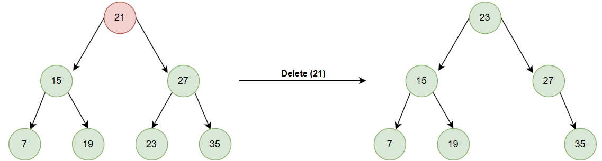

# 450. 删除二叉搜索树中的节点

[点此跳转题目链接](https://leetcode.cn/problems/delete-node-in-a-bst/description/)

## 题目描述

给定一个二叉搜索树的根节点 **root** 和一个值 **key**，删除二叉搜索树中的 **key** 对应的节点，并保证二叉搜索树的性质不变。返回二叉搜索树（有可能被更新）的根节点的引用。

一般来说，删除节点可分为两个步骤：

1. 首先找到需要删除的节点；
2. 如果找到了，删除它。


**示例 1:**


```
输入：root = [5,3,6,2,4,null,7], key = 3
输出：[5,4,6,2,null,null,7]
解释：给定需要删除的节点值是 3，所以我们首先找到 3 这个节点，然后删除它。
一个正确的答案是 [5,4,6,2,null,null,7], 如下图所示。
另一个正确答案是 [5,2,6,null,4,null,7]。
```

**示例 2:**

```
输入: root = [5,3,6,2,4,null,7], key = 0
输出: [5,3,6,2,4,null,7]
解释: 二叉树不包含值为 0 的节点
```

**示例 3:**

```
输入: root = [], key = 0
输出: []
```

 

**提示:**

- 节点数的范围 `[0, 104]`.
- `-105 <= Node.val <= 105`
- 节点值唯一
- `root` 是合法的二叉搜索树
- `-105 <= key <= 105`

 

**进阶：** 要求算法时间复杂度为 O(h)，h 为树的高度。


## 题解

为了深入理解删除节点的方法，我们用迭代法解决，需要考虑清楚各种情况，然后分类讨论。对于要删除的节点 `d` ，存在以下三种情况：

:one: `d` 是叶子节点

:two: `d` 只有单侧子树（左右孩子有且仅有一个不为空）

:three: `d` 的左右孩子都不为空

前两种情况比较简单。 **当 `d` 是叶子节点时** ，显然，直接将其删除即可：

```cpp
if (!d->left && !d->right)
{
    if (d->val < pre->val) // 待删除节点是其父节点的左孩子
        pre->left = nullptr;
    else // 待删除节点是其父节点的右孩子
        pre->right = nullptr;
}
```

**当 `d` 只有单侧子树时** ，将 `d` 替换成不为空的那个孩子节点即可：

```cpp
else if (d->left && !d->right)
{
    if (d->val < pre->val)
        pre->left = d->left;
    else
        pre->right = d->left;
}
else if (!d->left && d->right)
{
    if (d->val < pre->val)
        pre->left = d->right;
    else
        pre->right = d->right;
}
```

第三种情况——**当 `d` 的左右孩子都不为空时**，就比较复杂了。我采取的方法是：**将 `d` 替换为其右子树中的最小节点（最左下节点）**。下面证明一下这么做的正确性。

记 `d` 的节点值为 $v_d$ ， `d` 的左子树节点值的集合为 $\mathbf{L}$ ， `d` 的右子树节点值集合为 $\mathbf{R}$ 。根据二叉树的性质，

$$
\begin{array}{l}
\forall v_l \in \mathbf{L} : v_l < v_d \\
\forall v_r \in \mathbf{R} : v_r > v_d \\
即 \enspace v_l < v_r
\end{array}
$$

现取出右子树的最小节点，即 $\mathbf{R}$ 中的最小值 $v_r' = min\{v_r\}$ ，则

$$
\begin{array}{l}
\forall v_r \in \mathbf{R} - v_r' : v_r' < v_r \\
因为 \enspace v_r' \in \mathbf{R}, \enspace 所以 \enspace \forall v_l \in \mathbf{L} : v_l < v_r' \\
所以 \enspace v_l < v_r' < v_r \\
所以 \enspace v_r' 可以替代 v_d 的位置
\end{array}
$$


结合下面的示例图可以更好理解：



> 图片来源：[二叉搜索树删除 | D栈 - Delft Stack](https://www.delftstack.com/zh/tutorial/data-structure/binary-search-tree-delete/) 

简而言之： **`d` 右子树的最小值，大于 `d` 左子树中所有值、小于 `d` 右子树中除了它本身的所有值，故可以替代 `d` ，成为 `d` 的左右子树的新根节点。** 

> 同理，也可以用左子树的最大节点来替换待删除节点

这部分的代码实现如下：

```cpp
// 找到待删除节点右孩子的最左下节点（右子树中的最小节点）
TreeNode *mostLeft = d->right;
// 特殊情况：待删除节点的右孩子无左孩子（自身就是最小节点）
if (!mostLeft->left)
{
    if (!mostLeft->right)
        d->right = nullptr;
    else
        d->right = mostLeft->right;
}
else
{
    TreeNode *preMostLeft = d; // 最左节点的父节点
    while (mostLeft->left)
    {
        preMostLeft = mostLeft;
        mostLeft = mostLeft->left;
    }
    // 将最左节点从原来的位置移除
    if (mostLeft->right)
        preMostLeft->left = mostLeft->right;
    else
        preMostLeft->left = nullptr;
}
// 将待删除节点替换为该最左节点
mostLeft->left = d->left;
mostLeft->right = d->right;
if (d->val < pre->val)
    pre->left = mostLeft;
else
    pre->right = mostLeft;
```

综上所述，迭代法的整体代码实现如下：

```cpp
TreeNode *deleteNode(TreeNode *root, int key)
{
    TreeNode *d = root; // 待删除节点d
    TreeNode *pre = new TreeNode(INT_MAX, d, nullptr);
    TreeNode *dummyRoot = pre; // 虚拟根节点
    while (d)
    {
        if (d->val == key)
            break;
        pre = d;
        if (key < d->val)
            d = d->left;
        else
            d = d->right;
    }
    if (!d) // 没找到要删除的节点
        return root;
    else
    {
        // 待删除节点是叶子节点的情况
        if (!d->left && !d->right)
        {
            if (d->val < pre->val) // 待删除节点是其父节点的左孩子
                pre->left = nullptr;
            else // 待删除节点是其父节点的右孩子
                pre->right = nullptr;
        }
        // 待删除节点只有单侧子树的情况
        else if (d->left && !d->right)
        {
            if (d->val < pre->val)
                pre->left = d->left;
            else
                pre->right = d->left;
        }
        else if (!d->left && d->right)
        {
            if (d->val < pre->val)
                pre->left = d->right;
            else
                pre->right = d->right;
        }
        // 待删除节点左右孩子都不为空
        else
        {
            // 找到待删除节点右孩子的最左下节点（右子树中的最小节点）
            TreeNode *mostLeft = d->right;
            // 特殊情况：待删除节点的右孩子无左孩子（自身就是最小节点）
            if (!mostLeft->left)
            {
                if (!mostLeft->right)
                    d->right = nullptr;
                else
                    d->right = mostLeft->right;
            }
            else
            {
                TreeNode *preMostLeft = d; // 最左节点的父节点
                while (mostLeft->left)
                {
                    preMostLeft = mostLeft;
                    mostLeft = mostLeft->left;
                }
                // 将最左节点从原来的位置移除
                if (mostLeft->right)
                    preMostLeft->left = mostLeft->right;
                else
                    preMostLeft->left = nullptr;
            }
            // 将待删除节点替换为该最左节点
            mostLeft->left = d->left;
            mostLeft->right = d->right;
            if (d->val < pre->val)
                pre->left = mostLeft;
            else
                pre->right = mostLeft;
        }
        delete d; // 释放删除节点的空间
    }
    return dummyRoot->left;
}
```

可以看出，该算法从根节点起，仅向下搜索一次即可完成删除，满足题目进阶要求的 $O(h)$ 时间复杂度， $h$ 为树的高度。

同时，该算法处理待删除节点左右子树均不为空的情况时，虽然相对复杂，但是**删除节点后树的高度和结构基本不会变化**（最多减少一层，可以从上面的示例图看出），可以维护二叉搜索树的搜索效率（因为搜索删除节点附近的节点时，路径基本不变）。

[代码随想录](https://programmercarl.com/0450.删除二叉搜索树中的节点.html#思路) 中Carl的处理方法是 **将待删除节点的左子树，连接到右子树的最左下节点的左孩子处，然后用该右子树替代已删除节点** 。这样的代码会简单一些，也便于递归实现，但是存在每次删除节点都可能增加树的高度、降低搜索效率的问题。
