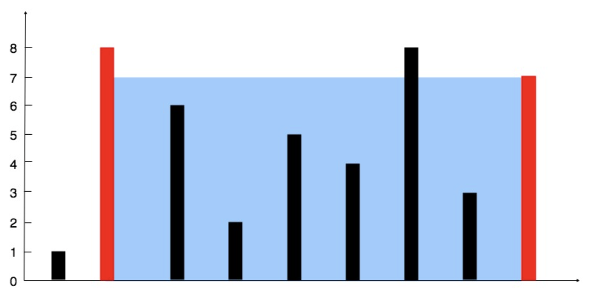

# 11. 盛水最多的容器

<div style="text-align: right;">―――感觉这题的双指针用法很有启发，故记录一下推演过程</div>

## 题目描述   

给定一个长度为 n 的整数数组 height 。有 n 条垂线，第 i 条线的两个端点是 (i, 0) 和 (i, height[i]) 。

找出其中的两条线，使得它们与 x 轴共同构成的容器可以容纳最多的水。

返回容器可以储存的最大水量。

**说明**：你不能倾斜容器。
<br>

**示例 1：**

   
> **输入：** [1,8,6,2,5,4,8,3,7]
**输出：** 49 
**解释：** 图中垂直线代表输入数组 [1,8,6,2,5,4,8,3,7]。在此情况下，容器能够容纳水（表示为蓝色部分）的最大值为 49。

**示例 2 ：**
> **输入：** height = [1,1]
**输出：** 1
 
<br>

**提示：**
- n == height.length
- 2 <= n <= 105
- 0 <= height[i] <= 104

## 思路分析   

显然，这题可以抽象成求长宽变化的矩形的最大面积的问题。由于暴力遍历搜索的时间复杂度为 $O(n^{2})$ ，数据量大起来很容易超时，故考虑用双指针优化算法。
> 自然地，考虑：双指针起点分别在哪？怎么移动？

为了减少时间复杂度，基于直觉和以往经验，考虑在数组的起点和终点分别定义左右指针，然后两指针向中间走，直到它们相遇――这样的时间复杂度仅为 $O(n)$。

> 那么这种“直觉”是否正确？可以推导一下。

设左右指针在它们第 $i$个位置所指的height分别为 $x_{i}$、 $y_{i}$。
- 开始时，左右指针分别在起点终点，指向的height分别为 $x_{0}$、 $y_{0}$
- 不妨假设 $x_{0} < y_{0}$，此时面积 $S_{0} = min(x_{0}, y_{0}) * (y_{0} - x_{0})$
> 此时左边height比右边矮，直觉上我们考虑让**左指针**往**右**走，以探索更高的height进而找到更大的面积。接下来采用**反证法**证明这么做是科学的：
- 假设让**右指针**往**左**走，可能找到更大的面积
  - 此时左指针仍指向 $x_{0}$不变，右指针指向新的 $y_{1}$
  - 若 $y_{1} < x_{0}$，则 $min(x_{0}, y_{1}) = y_{1} < min(x_{0}, y_{0})$   

    若 $y_{1} > x_{0}$，则 $min(x_{0}, y_{1}) = x_{0} = min(x_{0}, y_{0})$   

    所以， $$min(x_{0}, y_{1}) <= min(x_{0}, y_{0})$$

    
  - 显然， $y_1 - x_0 < y_0 - x_0$
  
  - 所以， $S_1 = min(x_0, y_1) * (y_1 - x_0) \leq S_0$
  
  - 故，这么做不可能找到更大的面积，假设不成立。
- 综上，应该让左指针右移，也就是**每次让所指height较小的指针向另一指针方向移动，直到左右指针相遇**。

### 代码（C++）

```
class Solution
{
public:
    int maxArea(vector<int> &height)
    {
        // 思路：这题本质上是一个求矩形最大面积的问题
        // 利用双指针优化时间复杂度
        int leftP = 0, rightP = height.size() - 1, maxArea = 0;
        while (leftP < rightP)
        {
            maxArea = max(maxArea, (rightP - leftP) * min(height[rightP], height[leftP]));

            // 更新左右指针
            if (height[leftP] < height[rightP])
                leftP++;
            else
                rightP--;
        }
        return maxArea;
    }
};
```