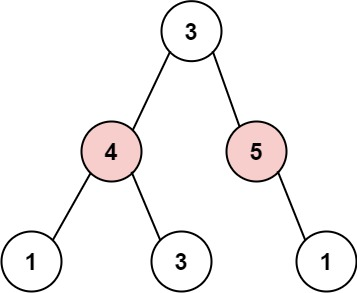

# 337. 打家劫舍 III

[点此跳转题目链接](https://leetcode.cn/problems/house-robber-iii/description/)

## 题目描述

小偷又发现了一个新的可行窃的地区。这个地区只有一个入口，我们称之为 `root` 。

除了 `root` 之外，每栋房子有且只有一个“父“房子与之相连。一番侦察之后，聪明的小偷意识到“这个地方的所有房屋的排列类似于一棵二叉树”。 如果 **两个直接相连的房子在同一天晚上被打劫** ，房屋将自动报警。

给定二叉树的 `root` 。返回 ***在不触动警报的情况下** ，小偷能够盗取的最高金额* 。

 

**示例 1:**


```
输入: root = [3,2,3,null,3,null,1]
输出: 7 
解释: 小偷一晚能够盗取的最高金额 3 + 3 + 1 = 7
```

**示例 2:**



```
输入: root = [3,4,5,1,3,null,1]
输出: 9
解释: 小偷一晚能够盗取的最高金额 4 + 5 = 9
```

 

**提示：**

- 树的节点数在 `[1, 104]` 范围内
- `0 <= Node.val <= 104`


## 题解

由于二叉树的结构，不难想到从根节点往下递归搜索的方法，每次考虑抢当前节点、不抢孩子节点和不抢当前节点、可能抢孩子节点的情况即可。同时，用一个哈希表存储已经求过的节点的最大金额，实现记忆化，降低时间开销：

```cpp
class Solution1I // 记忆化的递归暴力搜索
{
private:
    unordered_map<TreeNode*, int> valueMap; // 记忆化：记录搜索过的节点

public:
    int rob(TreeNode *root)
    {
        if (!root)
            return 0; // 空节点，没法抢
        if (!root->left && !root->right)
            return root->val; // 没有左右孩子，直接抢当前节点
        
        // 有记忆：直接采用求过的该节点能偷的最大金额
        if (valueMap.find(root) != valueMap.end())
            return valueMap[root];

        // 偷当前节点（父节点），则不能偷左右孩子，但考虑孙子节点
        int v1 = root->val;
        if (root->left)
            v1 += rob(root->left->left) + rob(root->left->right);
        if (root->right)
            v1 += rob(root->right->left) + rob(root->right->right);

        // 不偷当前节点（父节点），则可以考虑左右孩子节点
        int v2 = rob(root->left) + rob(root->right);
        
        valueMap[root] = max(v1, v2); // 记录当前节点能偷的最大金额
        return valueMap[root];
    }
};
```

此外，还可以采用**动态规划**的方法。本题是我做的第一道树形结构中运用动态规划的题目，参考了 [Carl的解决方案](https://programmercarl.com/0337.打家劫舍III.html#思路) ，感觉很巧妙：

1. **确定递归函数的参数和返回值**

这里我们要求一个节点 偷与不偷的两个状态所得到的金钱，那么返回值就是一个长度为2的数组。

参数为当前节点，代码如下：

```cpp
/// @brief 抢或不抢当前节点root，在以root为根的子树中能获得的最大金额
/// @param root（当前节点）
/// @return 大小为2的数组dp，dp[0]表示不抢root能得最大金额，dp[1]表示抢
vector<int> tryRob(TreeNode *root) {
```

其实这里的返回数组就是 `dp` 数组。

所以 `dp` 数组的含义：下标为0记录不偷该节点所得到的的最大金钱，下标为1记录偷该节点所得到的的最大金钱。

**所以本题 `dp` 数组就是一个长度为2的数组！**

那么长度为2的数组怎么标记树中每个节点的状态呢？

**别忘了在递归的过程中，系统栈会保存每一层递归的参数**。

如果还不理解的话，就接着往下看，看到代码就理解了。

确定终止条件

在遍历的过程中，如果遇到空节点的话，很明显，无论偷还是不偷都是0，所以就返回

```text
if (cur == NULL) return vector<int>{0, 0};
```

这也相当于dp数组的初始化

1. 确定遍历顺序

首先明确的是使用后序遍历。 因为要通过递归函数的返回值来做下一步计算。

通过递归左节点，得到左节点偷与不偷的金钱。

通过递归右节点，得到右节点偷与不偷的金钱。

代码如下：

```cpp
// 下标0：不偷，下标1：偷
vector<int> left = robTree(cur->left); // 左
vector<int> right = robTree(cur->right); // 右
// 中
```

1. 确定单层递归的逻辑

如果是偷当前节点，那么左右孩子就不能偷，val1 = cur->val + left[0] + right[0]; （**如果对下标含义不理解就再回顾一下dp数组的含义**）

如果不偷当前节点，那么左右孩子就可以偷，至于到底偷不偷一定是选一个最大的，所以：val2 = max(left[0], left[1]) + max(right[0], right[1]);

最后当前节点的状态就是{val2, val1}; 即：{不偷当前节点得到的最大金钱，偷当前节点得到的最大金钱}

代码如下：

```cpp
vector<int> left = robTree(cur->left); // 左
vector<int> right = robTree(cur->right); // 右

// 偷cur
int val1 = cur->val + left[0] + right[0];
// 不偷cur
int val2 = max(left[0], left[1]) + max(right[0], right[1]);
return {val2, val1};
```


1. 举例推导dp数组

以示例1为例，dp数组状态如下：（**注意用后序遍历的方式推导**）


**最后头结点就是 取下标0 和 下标1的最大值就是偷得的最大金钱**。