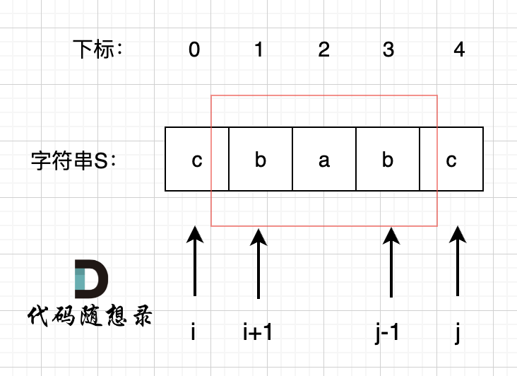

# 647. 回文子串

[点此跳转题目链接](https://leetcode.cn/problems/palindromic-substrings/description/)

## 题目描述

给你一个字符串 `s` ，请你统计并返回这个字符串中 **回文子串** 的数目。

**回文字符串** 是正着读和倒过来读一样的字符串。

**子字符串** 是字符串中的由连续字符组成的一个序列。


**示例 1：**

```
输入：s = "abc"
输出：3
解释：三个回文子串: "a", "b", "c"
```

**示例 2：**

```
输入：s = "aaa"
输出：6
解释：6个回文子串: "a", "a", "a", "aa", "aa", "aaa"
```

 

**提示：**

- `1 <= s.length <= 1000`
- `s` 由小写英文字母组成


## 题解

**动态规划** 经典题型之一。

首先考虑暴力解法，不难看出需要 $O(n^2)$ 的时间复杂度来遍历所有子串，然后对每个子串又需要花费 $O(n)$ 的时间复杂度来判断它是不是回文的，所以总时间复杂度为 $O(n^3)$ 。

于是考虑引入动态规划中经典的 `dp` 数组，简化循环遍历和判断回文的过程。考虑一个子串 `s[i, j]` ：

- 如果 `i = j` ，即单个字符，视为回文子串

- 否则，即多个字符组成的子串，

  - 如果 `i + 1 = j` ，即两个字符组成的子串，显然它俩相同即构成回文子串、否则不构成

  - 否则，即大于两个字符组成的子串，

    - 如果 `s[i] != s[j]` ，显然不构成回文子串

    - 否则，取决于其内部的子串 `s[i + 1, j - 1]` 是否回文，即：

      

      可以看出，此时若 `s[i + 1, j - 1]` 回文，则 `s[i, j]` 也回文。

**综上所述，** 我们可以

- 确定 `dp` 数组含义： `dp[i][j]` 表示子串 `s[i][j]` 是否回文

  > 这与常见的动态规划中 `dp` 数组不太一样，因为这里的 `dp` 并不直接存储正确结果的数量，而是判断结果是否正确（本题中即是否回文）。
  >
  > 所以为了记录正确结果数量，可以维护一个计数器 `res` ，每次判断出 `dp[i][j] = true` 后 `res` 加一即可。

- 确定状态转移方程：根据上面的分析，不难得出

  ```cpp
  if (i == j) {
      dp[i][j] = true;
      res++;
  } else if (s[i] == s[j]) {
      if (i + 1 == j) {
          dp[i][j] = true;
          res++;
      } else {
          dp[i][j] = dp[i + 1][j - 1];
          if (dp[i][j]) {
              res++;
          }
      }
  }
  ```

  > 将 `dp` 数组初始化为全 `false` ，则不用单独处理 `s[i] != s[j]` 的情况了。

- 确定遍历顺序：根据状态转移方程， `dp[i][j]` 由 `dp[i + 1][j - 1]` 转移而来，而 `dp[i + 1][j - 1]` 是在 `dp[i][j]` 的 “左下角” ：

  

  所以，遍历顺序要 “从下到上、从左到右” ，即：

  ```cpp
  for (int i = n; i >= 0; --i) {
  	for (int j = i; j <= n; ++j) {
          ...
      }	
  }
  ```

**代码（C++）**

```cpp
class Solution {
public:
    int countSubstrings(string s) {
        // 初始化dp数组（全为false）
        vector<vector<bool>> dp(s.size(), vector<bool>(s.size(), false));
        int res = 0;

        for (int i = s.size() - 1; i >= 0; --i) {
            for (int j = i; j < s.size(); ++j) {
                if (i == j) {
                    dp[i][j] = true;
                    res++;
                } else if (s[i] == s[j]) {
                    if (i + 1 == j) {
                        dp[i][j] = true;
                        res++;
                    } else {
                        dp[i][j] = dp[i + 1][j - 1];
                        if (dp[i][j]) {
                            res++;
                        }
                    }
                }
            }
        }

        return res;
    }
};
```


