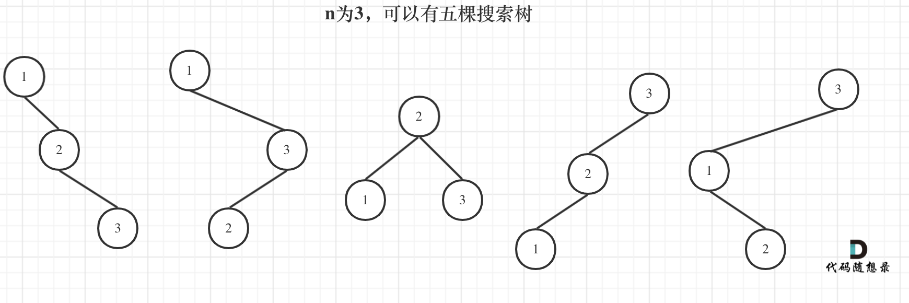

# 96. 不同的二叉搜索树

[点此跳转题目链接](https://leetcode.cn/problems/unique-binary-search-trees/description/)

## 题目描述

给你一个整数 `n` ，求恰由 `n` 个节点组成且节点值从 `1` 到 `n` 互不相同的 **二叉搜索树** 有多少种？返回满足题意的二叉搜索树的种数。

 

**示例 1：**


```
输入：n = 3
输出：5
```

**示例 2：**

```
输入：n = 1
输出：1
```

 

**提示：**

- `1 <= n <= 19`


## 题解

动态规划解决，要动点脑子的那种 :thought_balloon: ​ 

由于二叉搜索树的特性，我们很难一下找出什么种数与 `n` 之间的关系，或者 `n` 与 `n - 1` 分别对应的树形之间的关系。不妨尝试一下从基本情况开始考虑：

当 `n = 0` 时，只有空树这一种情况。

当 `n = 1` 时，只有平凡树这一种情况。

当 `n = 2` 时，有下面两种情况：

```
1      2
 \    /
  2  1
```

当 `n = 3` 时，有上面示例1种的5种情况，即：



> 图片来源：[代码随想录](https://programmercarl.com/0096.不同的二叉搜索树.html#思路)

可以发现，我们可以把 `n = 3` 的情况进一步分为3种：

- 以1为根节点时，左子树为空、右子树的“布局”和 `n = 2` 时的两种情况相同
- 以2为跟节点时，左右子树都不为空，且“布局”和 `n = 1` 时的情况相同
- 以3为根节点时，右子树为空、左子树的“布局”和 `n = 2` 时的两种情况相同

> 这里强调“布局”，即（子）树的“形状”，是因为根据二叉搜索树的性质，对于同样长度的数列（无重复数字），无论具体数字有何差异，生成的二叉搜索树的可能形状都是相同的——它只关注数字间的大小关系，而不是具体的数值。

此时 `2 = n - 1` 、 `1 = n - 2` ，貌似我们找到了可以由重叠子问题推导的方法——即通过 `dp[i - 1]` 和 `dp[i - 2]` 推导出 `dp[i]` 的某种算法。

进一步，上述三种情况里，“空子树”其实也可以对应 `n = 0` 时的情况，于是它们仨可以总结为：

元素1为根节点搜索树的数量 = （右子树）2个元素的搜索树数量 * （左子树）0个元素的搜索树数量

元素2为根结点搜索树的数量 = （右子树）1个元素的搜索树数量 * （左子树）1个元素的搜索树数量

元素3为根结点搜索树的数量 = （右子树）0个元素的搜索树数量 * （左子树）2个元素的搜索树数量

有2个元素的搜索树数量就是 `dp[2]` 

有1个元素的搜索树数量就是 `dp[1]` 

有0个元素的搜索树数量就是 `dp[0]` 

所以 `dp[3] = dp[2] * dp[0] + dp[1] * dp[1] + dp[0] * dp[2]` 

扒张 [代码随想录](https://programmercarl.com/0096.不同的二叉搜索树.html#思路) 上的图来直观说明：


至此，我们可以基本得出一个状态转移方程： `dp[i] = sum(dp[j - 1] * dp[i - j])` ，其中 `0 < j < i` 。


接下来，我们采用更严谨的方法证明上面的结论。

首先定义一下基本变量。之前说过，二叉搜索树的布局/形状只和生成之的数列长度有关，于是记 **长度为 $n$ 的数列生成的二叉搜索树的种数** 为 $S(n)$ 。

同时，记 **长度为 $n$ 的递增数列生成的、以数列中某个数 $m$ 为根节点的二叉搜索树的种数** 为 $C(n, m)$ 。考虑这棵树的子树，显然左子树的种数可以表示为 $S(m - 1)$ 、右子树的种树可以表示为 $S(n - m)$ ，所以根据左右子树的排列组合，有

$$
C(n, m) = S(m - 1) \cdot S(n - m) \qquad (1)
$$

而对于由 $1, 2, ... , n$ 生成的二叉搜索树（题目所求），分别以其中各数为根节点，显然有

$$
S(n) = \sum_{m = 1}^{n}C(n, m) \qquad (2)
$$

将 $(1)$ 带入 $(2)$ ，得

$$
S(n) = \sum_{m = 1}^{n} S(m - 1) \cdot S(n - m)
$$

这与我们上面得到的状态转移方程一致，其中 $S(n)$ 其实就是我们熟悉的 `dp[n]` 了。


**代码（C++）**

```cpp
int numTrees(int n)
{
    vector<int> dp(n + 1);
    dp[0] = 0, dp[1] = 1;
    for (int i = 2; i <= n; ++i) {
        for (int j = 1; j <= i; ++j)
            dp[i] += dp[j - 1] * dp[i - j];
    }
    return dp[n];
}
```

