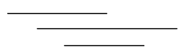
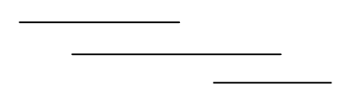

# 435. 无重叠区间

[点此跳转题目链接](https://leetcode.cn/problems/non-overlapping-intervals/description/)

## 题目描述

给定一个区间的集合 `intervals` ，其中 `intervals[i] = [starti, endi]` 。返回 *需要移除区间的最小数量，使剩余区间互不重叠* 。

 

**示例 1:**

```
输入: intervals = [[1,2],[2,3],[3,4],[1,3]]
输出: 1
解释: 移除 [1,3] 后，剩下的区间没有重叠。
```

**示例 2:**

```
输入: intervals = [ [1,2], [1,2], [1,2] ]
输出: 2
解释: 你需要移除两个 [1,2] 来使剩下的区间没有重叠。
```

**示例 3:**

```
输入: intervals = [ [1,2], [2,3] ]
输出: 0
解释: 你不需要移除任何区间，因为它们已经是无重叠的了。
```

 

**提示:**

- `1 <= intervals.length <= 105`
- `intervals[i].length == 2`
- `-5 * 104 <= starti < endi <= 5 * 104`


## 题解

贪心算法解决。这题和 [452. 用最少数量的箭引爆气球](https://leetcode.cn/problems/minimum-number-of-arrows-to-burst-balloons/description/) 蛮像的，因为要“ **去除** 重叠区间”自然得先“ **找到** 重叠区间”。还是先对原区间集合按照左边界从小到大（按右边界同理）排序，然后“贪心”地在顺序遍历过程中找到那些“互相重叠”的区间。

> 这里的“互相重叠”指的是两两之间都重叠，例如：
>
> 
>
> 上面每条线段表示一个区间。可以看出，任意两线段（区间）之间都有重叠区域，即这三个区间互相重叠。而如果是下面这种情况：
>
> 
>
> 第1、2个区间有重叠，第2、3个区间有重叠，但是1、3区间无重叠，则这仨不是“互相重叠”。

然后，每组“互相重叠”的区间最终应该只能保留其中某一个区间，从而组成最后的无重叠区间。因此，找到了互相重叠区间的数量，也就等于找到了最终无重叠区间的数量，那么用原区间的数量减去它，自然就是要移除区间的最小数量了。

**代码（C++）**

```cpp
int eraseOverlapIntervals(vector<vector<int>> &intervals)
{
    if (intervals.size() == 1)
        return 0;
    
    auto cmp = [](const vector<int> &a, const vector<int> &b) {
        return a[0] < b[0];
    };
    sort(intervals.begin(), intervals.end(), cmp);
    
    int iCount = 1; // 最终的无重叠区间数量
    int curMinRight = intervals[0][1];
    for (int i = 1; i < intervals.size(); ++i) {
        if (intervals[i][0] >= curMinRight) {
            iCount++;
            curMinRight = intervals[i][1];
        } else 
            curMinRight = min(intervals[i][1], curMinRight);
    }
    return intervals.size() - iCount;
}
```

