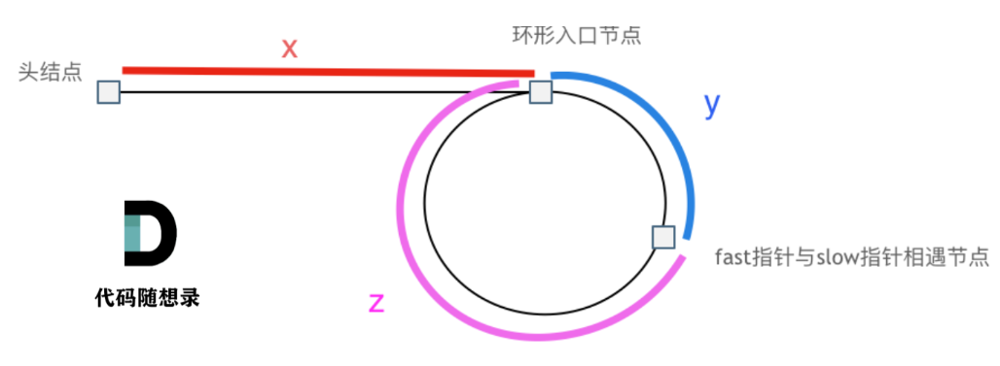

# 142. 环形链表 II

[点此跳转题目链接](https://leetcode.cn/problems/linked-list-cycle-ii/)

## 题目描述

给定一个链表的头节点  `head` ，返回链表开始入环的第一个节点。 *如果链表无环，则返回 `null`。*

如果链表中有某个节点，可以通过连续跟踪 `next` 指针再次到达，则链表中存在环。 为了表示给定链表中的环，评测系统内部使用整数 `pos` 来表示链表尾连接到链表中的位置（**索引从 0 开始**）。如果 `pos` 是 `-1`，则在该链表中没有环。**注意：`pos` 不作为参数进行传递**，仅仅是为了标识链表的实际情况。

**不允许修改** 链表。

 

**示例 1：**


```sh
输入：head = [3,2,0,-4], pos = 1
输出：返回索引为 1 的链表节点
解释：链表中有一个环，其尾部连接到第二个节点。
```

**示例 2：**


```sh
输入：head = [1,2], pos = 0
输出：返回索引为 0 的链表节点
解释：链表中有一个环，其尾部连接到第一个节点。
```

**示例 3：**


```sh
输入：head = [1], pos = -1
输出：返回 null
解释：链表中没有环。
```

 

**提示：**

- 链表中节点的数目范围在范围 `[0, 104]` 内
- `-105 <= Node.val <= 105`
- `pos` 的值为 `-1` 或者链表中的一个有效索引

 

**进阶：** 你是否可以使用 `O(1)` 空间解决此题？


## 题解

这题第一次做的时候想了一段时间没想出什么巧妙的方法，遂又采用集合存节点的暴力解法：

```cpp
ListNode *detectCycle(ListNode *head)
{
    // 思路：利用哈希集合，遇到重复结点则返回
    unordered_set<ListNode*> nodeSet;
    while (head) {
        if (nodeSet.find(head) != nodeSet.end())
            return head;
        nodeSet.insert(head);
        head = head->next;
    }
    return nullptr;
}
```

但其实通过我们可以推导一下，发现其中的有趣规律，从而不用其他容器，以 $O(1)$ 的空间复杂度解决。

采用**快慢双指针**，从起点开始，慢指针一次前进一个节点、快指针一次前进两个节点。如果快指针先遇到空节点，则显然该链表无环；否则，快慢指针第一次相遇的位置必定是在环内。

> 为什么若有环则两个指针一定会相遇：快指针入环前，始终在慢指针前面；两指针都入环后，快指针相当于以1个节点/次的**相对速度**（这个速度也是单位速度）追慢指针，所以肯定能相遇（想象操场跑步套圈）。

下面借助卡哥的图开始推导：



首先我们把所有情况统一为：快指针 `fast` 在环里面走了一圈后，在走第二圈过程中**第一次**遇到了入环的慢节点 `slow` 。

> 如果 $x$ 很长、环不太长，易知快指针可能在环里面转了若干圈才“等”到慢指针。但是“快指针多转的圈长”和“同一时间内慢指针在直链上走的长度”显然可以“抵消”，这完全不影响后续推导。

两个指针第一次相遇时，由于这之前 `fast` 的速度是 `slow` 的两倍，其路程也是 `slow` 的两倍。所以由上图可得：


$$
x + (y + z) + y = 2(x + y)
$$


化简可得：


$$
x = z
$$


而 $x$ 正是我们需要的：从头节点到环入口的长度。所以初遇后，让 `slow` 回到头节点，然后两个指针都以单位速度前进，下一次相遇时**必是在环入口节点**（ `slow` 走了 $x$ ， `fast` 走了 $z$ ，相等）。

**代码（C++）**

```cpp
ListNode *detectCycle(ListNode *head)
{
    // 思路：双指针，快指针一次走两个节点，慢指针一次走一个节点
    ListNode *fast = head, *slow = head;
    while (fast && fast->next) {
        fast = fast->next->next;
        slow = slow->next;
        if (fast == slow) {
            // 相遇后，慢指针回到链表起点，两个指针以单位速度前进，再次相遇位置就是环的起点
            slow = head;
            while (slow != fast) {
                slow = slow->next;
                fast = fast->next;
            }
            return fast;
        }
    }
    return nullptr;
}
```

更详细的推导可参考[代码随想录 (programmercarl.com)](https://programmercarl.com/0142.环形链表II.html#思路)。

