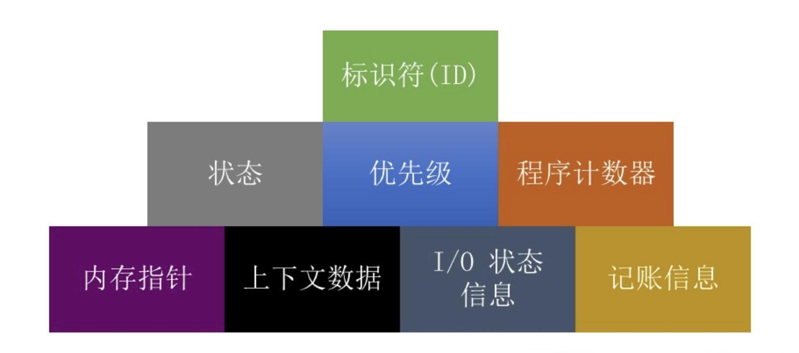
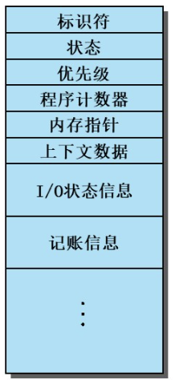
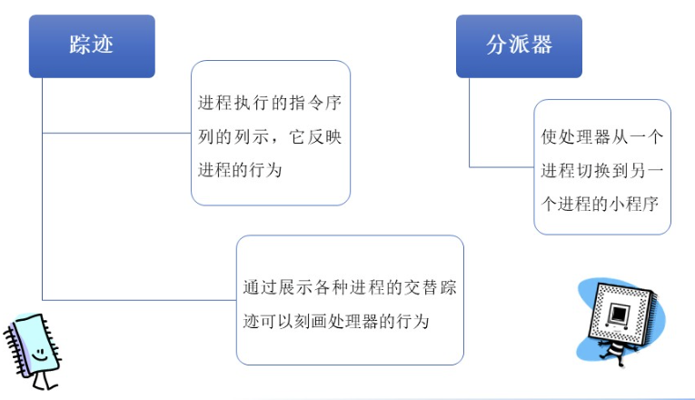

# 
操作系统

## 第三章 进程描述与控制

### 操作系统管理应用程序的执行
- 使资源可供多个应用程序使用
- 处理器在多个应用程序之间切换，使所有应用程序看起来都在不断向前推进
- 处理器和I/O设备得以高效利用
**“不让处理器闲下来”**

### 进程元素
**程序代码**
- 可由执行同一个程序的多个其他进程分享  

**与该代码关联的一组数据**
- 当处理器开始执行程序代码时，我们称该执行实体为**进程**   
   
**当程序运行时，可以通过一系列元素唯一地勾画与之相应的进程，包括：**
  

### 进程控制块（PCB）
- 包含进程元素
- 一个运行中的进程有可能会被中断，之后又可以恢复执行，就好像中断未曾发生过一样
- 由OS创建和管理
- 实现多进程支持的关键工具  

   
*创建一个进程实际上是处理器给程序分配一个PCB（如果PCB还有空的/可用的）*

### 进程状态
