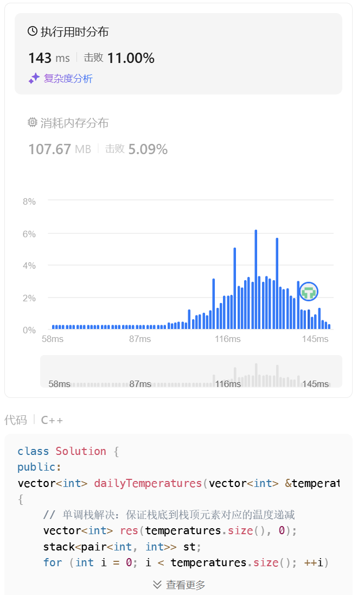
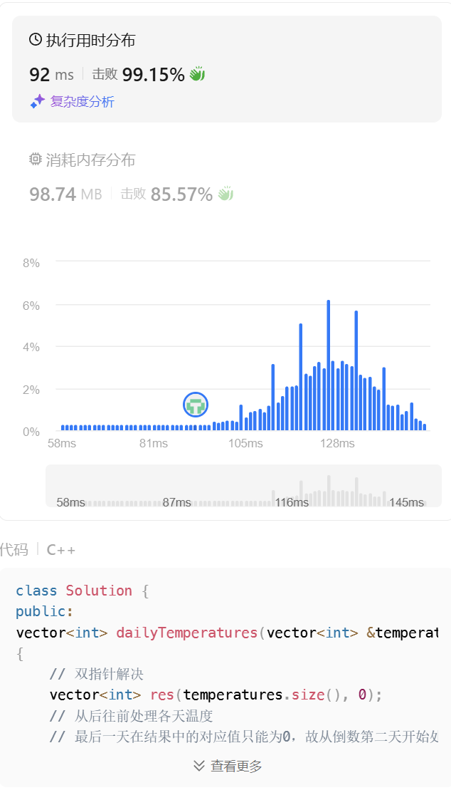

# 739. 每日温度

[点此跳转题目链接](https://leetcode.cn/problems/daily-temperatures/description/?envType=study-plan-v2&envId=top-100-liked)

## 题目描述

给定一个整数数组 `temperatures` ，表示每天的温度，返回一个数组 `answer` ，其中 `answer[i]` 是指对于第 `i` 天，下一个更高温度出现在几天后。如果气温在这之后都不会升高，请在该位置用 `0` 来代替。

 

**示例 1:**

```
输入: temperatures = [73,74,75,71,69,72,76,73]
输出: [1,1,4,2,1,1,0,0]
```

**示例 2:**

```
输入: temperatures = [30,40,50,60]
输出: [1,1,1,0]
```

**示例 3:**

```
输入: temperatures = [30,60,90]
输出: [1,1,0]
```

 

**提示：**

- `1 <= temperatures.length <= 105`
- `30 <= temperatures[i] <= 100`


## 题解

这个题目的核心问题可以抽象成“找到比第一个当前数字大的元素，记录其下标，然后处理下一个数字”，于是想到用单调栈解决：保证栈中元素按照数组中顺序入栈，同时，栈顶到栈底的元素越来越大——栈底元素是先入栈的，又最大，可以理解为“目前还没遇到比它更大的，于是先放这”。然后，如果遇到比栈顶大的，就弹出栈顶并记录相应结果，将新元素入栈（注意这里要用while之类的循环，确保栈上比当前数字小的元素都弹出）。

**代码（C++）**

```cpp
vector<int> dailyTemperatures(vector<int> &temperatures)
{
    // 单调栈解决：保证栈底到栈顶元素对应的温度递减
    vector<int> res(temperatures.size(), 0);
    stack<pair<int, int>> st;
    for (int i = 0; i < temperatures.size(); ++i)
    {
        while (!st.empty() && temperatures[i] > st.top().first)
        {
            res[st.top().second] = i - st.top().second;
            st.pop();
        }
        st.push(make_pair(temperatures[i], i));
    }
    return res;
}
```

不过这种算法效率不算快（由于入栈、出栈的时间开销比普通数组操作大），LeetCode上时空开销都不算出色：



看了下大佬们的解法，发现可以用双指针解决，方法也很巧妙。先看看代码：

```cpp
vector<int> dailyTemperatures_TwoPointer(vector<int> &temperatures)
{
    // 双指针解决
    vector<int> res(temperatures.size(), 0);
    // 从后往前处理各天温度
    // 最后一天在结果中的对应值只能为0，故从倒数第二天开始处理
    for (int cur = temperatures.size() - 2; cur >= 0; --cur)
    {
        int after = cur + 1; // 当前处理天数的后一天，自此往后找
        while (temperatures[after] <= temperatures[cur] && res[after] != 0)
            after += res[after]; // 由于从后向前处理，此时after肯定处理过了
        res[cur] = temperatures[after] > temperatures[cur] ? after - cur : 0;
    }
    return res;
}
```

主要思路在注释中基本写清楚了，即从后往前处理，这样可以利用后面已经得到的结果快速跳转到可能比当前值大的元素的位置。比较关键的是这部分：

```cpp
int after = cur + 1; // 当前处理天数的后一天，自此往后找
while (temperatures[after] <= temperatures[cur] && res[after] != 0)
    after += res[after]; // 由于从后向前处理，此时after肯定处理过了
res[cur] = temperatures[after] > temperatures[cur] ? after - cur : 0;
```

`after` 表示当前处理的元素（下标为 `cur` ）后面位置元素的下标。由于是从后往前处理， `cur + 1` , `cur + 2` , ... , `n - 1` （n为数组大小）位置的结果已知，即“第一个比该位置数字大的元素的位置，距离当前位置的距离”。

所以如果当前 `after` 位置的元素不大于 `cur` ，就可以在 `after` 上增加 `res[after]` ，就让 `after` 指向了其后第一个比它大的元素位置。而如果没有找到比 `cur` 处数字大的 `after` 位置且 `res[after]` 的值已经为0，表示之后不会有比 `temperature[after]` 大的，自然也不会有比 `temperature[cur]` 大的，故将 `res[cur]` 记为0，然后处理下一个（ `cur` 的前一个位置）。

这种算法就高效很多了：



golang写法也附一个：

```go
func dailyTemperatures(temperatures []int) []int {
	res := make([]int, len(temperatures))
	for cur := len(temperatures) - 2; cur >= 0; cur-- {
		after := cur + 1
		for temperatures[after] <= temperatures[cur] && res[after] != 0 {
			after += res[after]
		}
		if temperatures[after] > temperatures[cur] {
			res[cur] = after - cur
		}
	}
	return res
}
```

